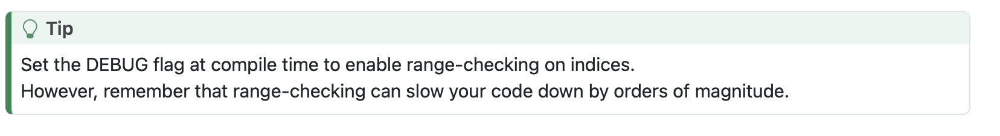

# Quarto Extension `admonitions`

The `admonitions` filter adds AsciiDoc-style paragraph [admonitions][] to [Quarto][].

## Installing

```bash
quarto add nessan/admonitions
```

This will install the extension under the `_extensions` subdirectory.
You should check in this directory if you're using version control.

Once it is installed, you add the extension as a filter in your `_quarto.yml` file as usual:

```yml
filters:
    - admonitions
```

## Using

Use the extension to draw attention to a paragraph. Start the first line of the paragraph with one of the following  five labels:

- NOTE:
- WARNING:
- TIP:
- CAUTION:
- IMPORTANT:

The label must be in uppercase and followed by a colon ( : ).

For example:

```markdown
TIP: To enable range-checking on indices, set the `DEBUG` flag at compile time. \
     However, bear in mind that range-checking can slow your code down by orders of magnitude.
```

This will be rendered as:


Each admonition type has its particular icon and the admonition content on the right can contain arbitrary markdown.

## Admonitions vs. Callouts

Quarto already has [callout blocks][] which are a very similar concept though with a wordier syntax.

For example:

```markdown
::: {.callout-tip}
To enable range-checking on indices, set the `DEBUG` flag at compile time. \
However, bear in mind that range-checking can slow your code down by orders of magnitude.
:::
```

This will be rendered as:



The markup for an admonition is very simple and clean without the need to resort to a custom div.

Of course, you can mix and match both styles without a problem.

## Examples

See the `examples` directory for demonstration projects using this extension.

## Acknowledgements

This extension is inspired by the simplicity of [AsciiDoc][] admonitions and uses the same `CSS` to style the output.

AsciiDoc also has the concept of a *block* admonition which is not replicated in this extension as Quarto's callout blocks work perfectly well for that purpose.

## TODO

1. It should be possible to customise the filter and, for example, let the user change the icons associated with the various admonitions.
2. The filter only handles `HTML` output.

## Contact

You can contact me by email [here](mailto:nzznfitz+gh@icloud.com).

## Copyright and License

Copyright (c) 2024-present Nessan Fitzmaurice.
You can use this software under the [MIT license][].

<!-- Reference links -->

[Quarto]: https://quarto.org
[AsciiDoc]: https://docs.asciidoctor.org/asciidoc/latest/
[admonitions]: https://docs.asciidoctor.org/asciidoc/latest/blocks/admonitions/
[callout blocks]: https://quarto.org/docs/authoring/callouts.html
[MIT license]: https://opensource.org/license/mit
